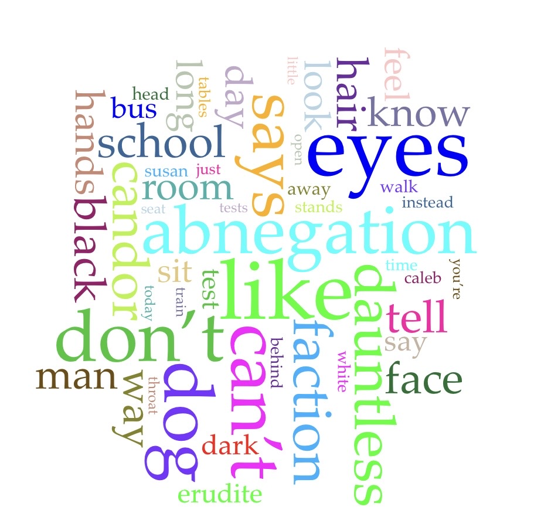



# Distant Reading Assignment 

## Voyant
I used Voyant to search an excerpt from the book “Divergent.” [Divergent Excerpt](https://www.lovereading4kids.co.uk/extract/6410/Divergent-by-Veronica-Roth.html)

## CoPilot

I also asked CoPilot to analyze the excerpt.

This is the response:

**Prompt: "Analyze how the concept of identity and faction choice is developed in the opening chapter of Divergent by Veronica Roth."**

***Copilot Reply:*** 
>*“Analysis of Divergent Chapters 1-2
Summary
Beatrice Prior, a 16-year-old from the selfless faction Abnegation, prepares for her aptitude test, which will help determine her future faction. Although she loves her family, she feels drawn to a different life. During the test, she faces simulation scenarios that reveal her courage, intelligence, and compassion.
Main Character: Beatrice (Tris)
Curious and independent despite Abnegation's expectations.
Struggles to fit into a faction focused on selflessness.
Shows bravery and quick thinking during the aptitude test.
Feels conflicted about leaving her family.
Key Themes
Identity and Choice
Beatrice is trying to discover who she truly is.
The aptitude test and Choosing Ceremony force her to decide her future.
Individuality vs. Conformity
The faction system expects people to fit one defining trait.
Beatrice's thoughts and actions suggest she does not fit neatly into one category.
Fear and Courage
During the test, she overcomes fear by staying calm and protecting others.
Courage is shown as acting despite fear rather than being fearless.
Symbolism
Mirror: Represents self-discovery and identity. Abnegation discourages mirrors because they promote self-focus.
Dog: Symbolizes fear. Beatrice succeeds by remaining calm instead of reacting violently.
Hawk Tattoo: Represents overcoming fear, foreshadowing Beatrice's future growth.
Conflict
Internal Conflict:
Beatrice is torn between loyalty to her family and the desire to find where she truly belongs.
External Conflict:
Growing tension exists between factions, especially Erudite and Abnegation.
Significance
These chapters introduce the dystopian faction system and establish Beatrice's central struggle: Can one person be defined by a single trait, or are people more complex than society allows? This question drives the rest of the novel.”*

### Results

After analyzing an excerpt of Veronica Roth’s Divergent using Voyant Tools and Microsoft Copilot, I found that they highlight the key differences between quantitative data visualization and qualitative AI analysis in distant reading. Voyant provides immediate, objective computational data, revealing a corpus of 4,011 words with a 0.281 vocabulary density, and maps thematic terms like "abnegation" and "dauntless" alongside sudden frequency spikes, such as the sharp rise of "dog" in segment 9 during the aptitude test sequence. Conversely, Copilot synthesizes these underlying themes into coherent literary discussions about identity, non-conformity, and faction pressure, filling in the narrative meaning that raw data lacks. However, this process reveals clear limits for both technologies: Voyant cannot interpret context or grammar (grouping prepositions and verbs like "like" together indiscriminately), while Copilot risks generating generic commentary or minor textual hallucinations rather than analyzing the raw text file directly. Ultimately, this exercise demonstrates that while distant reading tools excel at rapidly exposing structural patterns and guiding inquiry across large texts, human close reading remains essential to properly contextualize and evaluate these findings.

